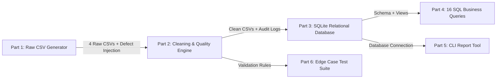
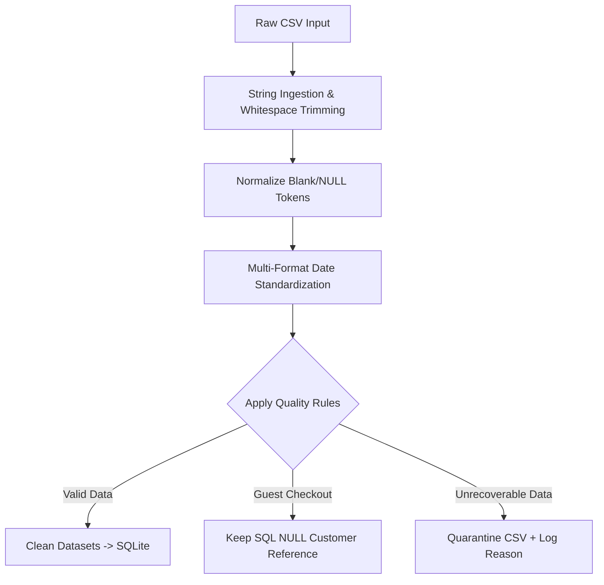

# E-Commerce Order Analytics System — Capstone Mini-Project

A local Python and SQL analytics system built to simulate enterprise data pipeline operations. The pipeline ingests multi-source raw order data containing deliberate real-world defects, cleans and validates the dataset, loads it into a constrained SQLite relational database, executes sixteen analytical business queries, provides an interactive command-line reporting tool, and asserts data integrity through an edge-case test suite.

---

## Executive Summary



- **Execution Runtime**: ~2.3 seconds end-to-end (all 5 pipeline stages)
- **Edge-Case Tests**: 4 / 4 test suites pass
- **Dataset Size**: 800 customers, 500 products, 4,758 orders, 11,016 order lines
- **Data Quality Audit**: 914 problem rows identified and processed across 10 distinct issue categories
- **Net Processed Revenue**: **$4,089,789.78** across 4,748 clean orders and 10,958 order line items between August 2024 and August 2026

---

## Key Results & Business Findings

| Analytical Question | Query Output Summary | Primary Business Insight |
|---|---|---|
| **Revenue by Category** | Electronics ($2.18M), Home ($1.44M), Clothing ($392K), Books ($75K) | Electronics dominates gross revenue due to high unit price. |
| **Return Rates** | Electronics (3.92%), Home (3.24%), Books (2.27%), Clothing (2.07%) | Return rates scale with product price and complexity. |
| **Revenue Concentration** | Top 10% customers produce 30.1% of revenue; top 20% produce 48.3% | Strong Pareto distribution driven by high-frequency VIP buyers. |
| **Customer Churn Risk** | 478 At-Risk, 174 Healthy, 52 Single-Order customers | Over 60% of historic buyers have exceeded a 30-day purchase gap. |
| **Category Loyalty** | 506 out of 693 buyers shifted category after initial purchase | Cross-category purchasing is common across long-term cohorts. |
| **Problematic SKUs** | 5 SKUs logged higher return quantities than total purchases | Specific defective product lines require supplier review. |
| **Unfulfilled Orders** | 49 customers placed orders that were never delivered | Delivery issues identified for targeted support resolution. |

*Detailed query output CSVs are generated at `output/query_results/`.*

---

## Repository & Project Layout

```
Mini-Project/
├── run_pipeline.py                  Pipeline runner executing all 5 stages
├── requirements.txt                 Dependencies (pandas)
├── README.md                        System documentation
│
├── src/
│   ├── config.py                    System paths, dataset constants, reference date
│   ├── generate_data.py             Part 1: Multi-source CSV dataset & defect generator
│   ├── clean_data.py                Part 2: Cleaning engine, validator & quarantine logger
│   ├── database.py                  Part 3: SQLite schema builder & data loader
│   ├── run_analysis.py              Part 4: Batch SQL query execution & CSV exporter
│   └── report_tool.py               Part 5: Interactive CLI summary reporting utility
│
├── sql/
│   ├── schema.sql                   Relational tables, foreign keys, CHECK constraints, views
│   └── queries/                     16 modular SQL analysis files (01_*.sql to 16_*.sql)
│
├── tests/
│   └── test_edge_cases.py           Edge-case assertion suite
│
├── data/
│   ├── raw/                         Raw generated CSV datasets
│   ├── clean/                       Validated CSV output ready for database ingestion
│   └── quarantine/                  Isolated bad records with audit reasons
│
└── output/
    ├── ecommerce.db                 Populated SQLite relational database
    ├── data_quality_report.md       Human-readable audit report
    ├── data_quality_report.json     Machine-readable quality metrics
    └── query_results/               Individual CSV result files per SQL query
```

---

## Pipeline Execution & Setup Guide

### 1. Environment Setup

```bash
cd Mini-Project

# Create and activate virtual environment
python -m venv .venv
# On Windows PowerShell:
.venv\Scripts\activate
# On Linux/macOS:
# source .venv/bin/activate

pip install -r requirements.txt
```

### 2. Full Pipeline Run

Execute the full data workflow in a single command:

```bash
python run_pipeline.py
```

This sequentially executes `generate` → `clean` → `load` → `analyse` → `test`.

### 3. Stage-by-Stage Execution

Individual pipeline stages can be executed independently:

```bash
python -m src.generate_data     # Build raw CSV datasets in data/raw/
python -m src.clean_data        # Run cleaning engine -> data/clean/ + quality reports
python -m src.database          # Ingest data into output/ecommerce.db
python -m src.run_analysis      # Run all 16 SQL queries -> output/query_results/
python tests/test_edge_cases.py # Run the edge-case assertion test suite
```

Selective stage chaining is supported:
```bash
python run_pipeline.py clean load analyse
```

---

## CLI Reporting Utility

The command-line reporting tool provides period summary metrics directly from the SQLite database:

```bash
# Monthly summary for a custom date range
python -m src.report_tool --type monthly --start 2026-02-01 --end 2026-07-31

# Weekly summary
python -m src.report_tool --type weekly --start 2026-06-01 --end 2026-06-30

# Interactive mode (prompts for grain and date bounds)
python -m src.report_tool
```

### Sample Output Format

```
MONTHLY REPORT   2026-02-01 to 2026-07-31   (181 days)
==============================================================================
Month       Orders     Revenue     Customers
---------  -------  ------------  ----------
2026-02        254    264,530.63         199
2026-03        361    358,722.11         252
2026-04        380    381,940.15         268
...

Summary vs previous 181 days (2025-08-04 to 2026-01-31)
------------------------------------------------------------------------------
Metric            This period     Previous     Change
----------------  ------------  ------------  -------
Total orders             2,165         1,182   +83.2%
Revenue           2,172,981.84  1,159,304.60   +87.4%
Unique customers           619           456   +35.7%
```

---

## Technical Details by Pipeline Component

### Part 1 — Data Generation & Defect Injection (`src/generate_data.py`)

Generates realistic e-commerce datasets driven by a seeded PRNG (`random.Random(42)`):
- **Cohort Alignment**: Order dates are strictly constrained to occur on or after customer registration dates.
- **Pareto Popularity**: Long-tail weight distributions drive realistic revenue concentration.
- **Seeded Affinity**: 30 specific product pairs are seeded as bundles to allow market basket analysis.
- **Credit Note Returns**: Negative quantities represent return items.

#### Summary of Injected Defects

| Injected Defect Category | Quantity Injected | Target Impact & Location |
|---|---:|---|
| Missing `customer_id` | 237 orders | 5.0% of orders contain empty or literal `"NULL"` IDs |
| Non-standard date formats (`DD-MM-YYYY`) | 190 orders | 4.0% of orders use non-ISO date strings |
| Future order dates | 10 orders | Orders dated past `REFERENCE_DATE` |
| Unformatted product names | 60 products | 12.0% of product names have erratic case/spacing |
| Malformed emails | 16 customers | 2.0% of emails lack `@` or domain components |
| Negative line quantities | 316 order lines | 2.9% of line items flagged as returns |
| Discount percentage > 100% | 12 order lines | Out-of-bounds discount percentages |
| Quantity = 0 | 20 order lines | Zero-unit line entries |
| Orphan line items | 15 order lines | Order items referencing non-existent order IDs |

---

### Part 2 — Data Cleaning & Quality Audit (`src/clean_data.py`)

Raw files are ingested using explicit string parsing (`dtype=str, keep_default_na=False`) to prevent automatic type inference from destroying data context.



#### Primary Cleaning Strategy

1. **Guest Checkout Preservation**: Orders missing a `customer_id` are converted to SQL `NULL` rather than dropped. This preserves global revenue totals while preventing unauthenticated purchases from distorting customer-level aggregates.
2. **CRM Email Auditing**: Malformed email addresses are preserved in customer records to maintain tracking history, while the affected IDs are surfaced in `output/data_quality_report.json`.
3. **Future Date Quarantine**: Future-dated orders are dropped and recorded in `data/quarantine/` to preserve time-series analysis accuracy.
4. **Discount Clamping**: Discounts over 100% are clamped to 100%, converting error rows into 100% promotional items ($0 line total) rather than negative refunds.

---

### Part 3 — Relational SQL Schema & Queries (`sql/`)

`sql/schema.sql` creates four primary tables with foreign keys and `CHECK` constraints, supplemented by two analytical views:

- **`order_lines` View**: Joins line items, orders, and products while centralizing the line revenue formula: `quantity * unit_price * (1 - discount_percent / 100)`. Return lines automatically yield negative revenue.
- **`revenue_lines` View**: Filters out `CANCELLED` orders from `order_lines` to ensure financial reports reflect net billed revenue.

#### Complete Business Query Catalog

| Query File | Business Metric / Question | Key SQL Techniques Employed |
|---|---|---|
| `01_revenue_per_category.sql` | Gross & net revenue by product category | `GROUP BY`, revenue calculation view |
| `02_top_10_customers.sql` | Top 10 customers by total spend | `JOIN`, `ORDER BY`, `LIMIT` |
| `03_monthly_order_count.sql` | Monthly order volume over 12 months | `STRFTIME`, CTE date series |
| `04_customers_never_delivered.sql` | Customers with unfulfilled orders | `HAVING SUM(CASE WHEN status != 'DELIVERED' ...)` |
| `05_products_with_more_returns.sql` | SKUs with higher return than purchase count | Conditional aggregation on `quantity` sign |
| `06_return_rate_per_category.sql` | Return rates across product categories | `SUM(CASE WHEN is_return = 1)` / `COUNT(*)` |
| `07_running_total_by_region.sql` | Cumulative revenue growth per region | `SUM() OVER (PARTITION BY region ORDER BY date)` |
| `08_product_rank_in_category.sql` | Product ranking within category by sales | `DENSE_RANK() OVER (PARTITION BY category ...)` |
| `09_customer_order_gaps.sql` | Average gap in days between consecutive orders | `LAG() OVER (...)`, `JULIANDAY` date arithmetic |
| `10_monthly_customer_value_bands.sql` | Customer segmentation into spend bands | Multi-level CTEs, `CASE` value tiering |
| `11_customer_quartiles.sql` | Platinum / Gold / Silver / Bronze ranking | `NTILE(4) OVER (ORDER BY total_spend DESC)` |
| `12_year_over_year_revenue.sql` | YoY monthly revenue comparison | Self `LEFT JOIN` offset by 12 months |
| `13_first_last_category.sql` | Initial vs latest category shift analysis | `FIRST_VALUE()`, `LAST_VALUE()` windowing |
| `14_cumulative_revenue_share.sql` | Pareto distribution curve of customer spend | Window functions over ordered customer totals |
| `15_cohort_retention.sql` | Monthly cohort retention analysis | Multi-CTE pivot on registration month |
| `16_frequently_bought_together.sql` | Product affinity pairing (basket analysis) | Self-join on order items with `a.product_id < b.product_id` |

---

### Part 4 — Edge-Case Test Suite (`tests/test_edge_cases.py`)

Verifies system resilience by testing edge cases against both Python cleaning functions and SQLite database constraints:

1. **Orphan Line Items**: Confirms `check_referential_integrity()` drops line items referencing missing orders, while SQLite's `FOREIGN KEY` constraint blocks direct insertion.
2. **Invalid Discounts**: Confirms discounts > 100% are clamped to 100% in Python, while SQLite's `CHECK (discount_percent BETWEEN 0 AND 100)` rejects un-clamped raw inputs.
3. **Zero Quantity**: Confirms `quantity = 0` line items are dropped during cleaning, while SQLite's `CHECK (quantity != 0)` rejects them at the database level.
4. **Future Dates**: Confirms orders with dates past `REFERENCE_DATE` are dropped and their corresponding line items quarantined.
