<div align="center">

# FreshMart — Retail Analytics Medallion Architecture Pipeline

*Databricks Serverless ETL Pipeline Engine Powered by PySpark & Delta Lake*

<p align="center">
  
  
  
  
</p>

</div>

---

## Executive Summary & Business Scope

FreshMart is an online grocery delivery startup operating across Delhi, Mumbai, and Bengaluru. Daily order records, order line items, rider delivery logs, and customer CRM snapshots land as flat files (CSV and JSON) in DBFS (Databricks File System).

Before this pipeline, data teams were unable to answer operational queries:
- Which product categories experience high return rates?
- Which fulfillment zones suffer from rider delays and delivery failures?
- What is the daily revenue and average basket size per city?
- Which customers generate the highest lifetime spend and order frequency?

This repository delivers an end-to-end Batch ETL Pipeline on Databricks Serverless using PySpark and Delta Lake. The pipeline follows a 3-Layer Medallion Architecture (Bronze -> Silver -> Gold) to enforce data quality, deduplication, SHA-256 PII protection, and executive reporting metrics.

---

## Medallion Architecture Pipeline Flow

```mermaid
flowchart LR
    subgraph RawSources["DBFS Raw Land Zone (/dbfs/raw/)"]
        R1["orders.csv"]
        R2["order_items.csv"]
        R3["customers.json"]
        R4["delivery.csv"]
    end

    subgraph BronzeLayer["Bronze Layer (/dbfs/delta/bronze/)"]
        B1["raw_orders"]
        B2["raw_order_items"]
        B3["raw_customers"]
        B4["raw_delivery_logs"]
    end

    subgraph SilverLayer["Silver Layer (/dbfs/delta/silver/)"]
        S1["orders"]
        S2["order_items"]
        S3["customers"]
        S4["delivery_logs"]
    end

    subgraph GoldLayer["Gold Layer (/dbfs/delta/gold/)"]
        G1["daily_revenue_by_city"]
        G2["product_return_summary"]
        G3["delivery_zone_performance"]
        G4["customer_summary"]
    end

    RawSources -->|Append Metadata| BronzeLayer
    BronzeLayer -->|Clean & Mask PII| SilverLayer
    SilverLayer -->|Business Aggregations| GoldLayer
```



---

## Medallion Storage & Layer Specifications

### 1. Ingestion & Storage Matrix

| Medallion Layer | Path / Location | Write Mode | Target Tables Created | Responsibilities & Transformations |
|---|---|---|---|---|
| Bronze | `/dbfs/delta/bronze/` | Append-only | `raw_orders`<br>`raw_order_items`<br>`raw_customers`<br>`raw_delivery_logs` | Ingests CSV & JSON raw files verbatim. Appends operational metadata: `_ingested_date` and `_source_file`. |
| Silver | `/dbfs/delta/silver/` | Overwrite / Merge | `orders`<br>`order_items`<br>`customers`<br>`delivery_logs` | Casts explicit data types, drops duplicate primary keys, computes net prices (`qty * price * (1 - discount)`), calculates delivery duration mins, flags null deliveries, and hashes email/phone via SHA-256. |
| Gold | `/dbfs/delta/gold/` | Full Refresh | `daily_revenue_by_city`<br>`product_return_summary`<br>`delivery_zone_performance`<br>`customer_summary` | Generates BI data marts for city revenue rollups, product return rates, logistics zone failure rates, and customer lifetime spend metrics. |

---

### 2. Silver Layer PII Security & Data Cleansing

To comply with data privacy standards, customer identifiers are hashed before persisting to the Silver layer:
- Email Hashing: `SHA-256(LOWER(TRIM(email)))` -> `email_hash` (64 hexadecimal string)
- Phone Hashing: `SHA-256(TRIM(phone))` -> `phone_hash`
- Delivery Incompletion: Missing `delivery_time` or status != `success` flagged as `is_incomplete = true`.
- Financial Line Math: `net_price = ROUND(qty * unit_price * (1 - discount_pct / 100), 2)`.

---

## Empirical Gold Data Mart Results

### 1. Daily Revenue Rollup by City (`gold.daily_revenue_by_city`)
| Order Date | City | Total Billed Revenue | Total Orders | Avg Basket Size |
|---|---|---|---|---|
| 2024-04-17 | Bengaluru | ₹ 12,091.25 | 18 | ₹ 671.74 |
| 2024-04-17 | Delhi | ₹ 7,808.70 | 20 | ₹ 390.44 |
| 2024-04-17 | Mumbai | ₹ 11,536.95 | 20 | ₹ 576.85 |
| 2024-04-16 | Bengaluru | ₹ 12,305.50 | 17 | ₹ 723.85 |
| 2024-04-16 | Delhi | ₹ 17,040.45 | 21 | ₹ 811.45 |
| 2024-04-16 | Mumbai | ₹ 10,079.65 | 15 | ₹ 671.98 |

### 2. Product Return Summary (`gold.product_return_summary`)
| Category | Product ID | Product Name | Total Units Sold | Returned Units | Return Rate (%) |
|---|---|---|---|---|---|
| Personal Care | PRD-903 | Head & Shoulders 180ml | 194 | 59 | **30.41 %** |
| Dairy | PRD-503 | Paneer 200g | 161 | 46 | **28.57 %** |
| Beverages | PRD-732 | Real Guava Juice 1L | 121 | 33 | **27.27 %** |
| Vegetables | PRD-602 | Onions 1kg | 115 | 29 | **25.22 %** |
| Staples | PRD-402 | Toor Dal 1kg | 151 | 38 | **25.17 %** |
| Vegetables | PRD-603 | Potatoes 1kg | 120 | 30 | **25.00 %** |

### 3. Delivery Zone Logistics Performance (`gold.delivery_zone_performance`)
| Zone | Total Deliveries | Successful | Failed | Failure Rate (%) | Avg Duration | Avg Distance |
|---|---|---|---|---|---|---|
| Rohini | 22 | 12 | 10 | **45.45 %** | 51.5 mins | 4.29 km |
| Whitefield | 11 | 7 | 4 | **36.36 %** | 53.4 mins | 4.58 km |
| Andheri West | 19 | 13 | 6 | **31.58 %** | 48.5 mins | 4.86 km |
| Bandra | 16 | 11 | 5 | **31.25 %** | 49.8 mins | 3.46 km |
| Dwarka | 16 | 11 | 5 | **31.25 %** | 52.3 mins | 4.41 km |

### 4. Customer Summary Snapshot (`gold.customer_summary`)
| Customer ID | Name | City | Total Orders | Total Lifetime Spend | Avg Order Value | Registered On |
|---|---|---|---|---|---|---|
| CUST-1036 | Shruti Saxena | Bengaluru | 6 | ₹ 6,349.60 | ₹ 1,058.27 | 2023-07-19 |
| CUST-1010 | Neha Iyer | Delhi | 6 | ₹ 6,236.95 | ₹ 1,039.49 | 2023-03-23 |
| CUST-1079 | Tanvi Choudhury | Bengaluru | 6 | ₹ 5,994.10 | ₹ 999.02 | 2023-02-08 |
| CUST-1002 | Sneha Patil | Mumbai | 6 | ₹ 5,472.00 | ₹ 912.00 | 2023-04-08 |
| CUST-1067 | Ananya Gupta | Bengaluru | 8 | ₹ 5,470.75 | ₹ 683.84 | 2023-10-08 |

---

## Repository Directory Structure

```
Mini-Project/
├── README.md                           # Master pipeline documentation
├── requirements.txt                    # PySpark and Delta dependencies
├── run_pipeline.py                     # Local execution wrapper script
├── FreshMart — Retail Analytics.docx   # Original specification document
├── freshmart_data/                     # Raw source data landing zone
│   ├── orders/                         # Daily order CSV exports (2024-04-11 to 2024-04-17)
│   ├── order_items/                    # Daily order item CSV exports (2024-04-11 to 2024-04-17)
│   ├── delivery/                       # Daily delivery log CSV exports (2024-04-11 to 2024-04-17)
│   └── customers/                      # CRM JSON snapshot
├── notebooks/                          # Databricks PySpark Notebooks
│   ├── nb_bronze_ingest.py             # STEP 1: Bronze raw ingestion
│   ├── nb_silver_transform.py          # STEP 2: Silver clean & conform
│   ├── nb_gold_aggregate.py            # STEP 3: Gold business aggregations
│   └── nb_orchestrator.py              # STEP 4: Master %run orchestrator
├── src/                                # Utility scripts
│   ├── config.py                       # Environment paths & config
│   └── data_generator.py               # CRM JSON snapshot builder
├── sql/                                # Spark SQL Gold queries
│   ├── 01_daily_revenue_by_city.sql
│   ├── 02_product_return_summary.sql
│   ├── 03_delivery_zone_performance.sql
│   └── 04_customer_summary.sql
└── tests/                              # Unit assertions suite
    └── test_pipeline.py
```

---

## Execution & Deployment Guide

### 1. Deploying to Databricks Workspace
1. Import all `.py` files inside `notebooks/` into your Databricks Workspace.
2. Upload the raw source files into DBFS landing zone paths under `/dbfs/raw/`.
3. Open `notebooks/nb_orchestrator.py` and click **Run All**, or attach it to a daily Databricks Job schedule.

### 2. Local Execution with PySpark
Install local requirements and run the master execution script:

```bash
pip install -r requirements.txt
python run_pipeline.py
```

### 3. Running Unit Assertions
Run the automated test suite:

```bash
python -m unittest tests/test_pipeline.py
```
