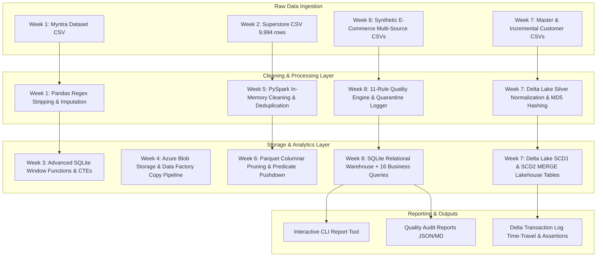
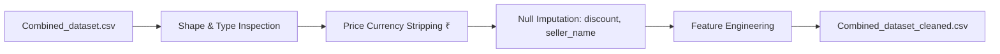
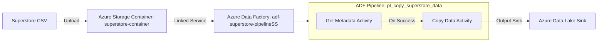
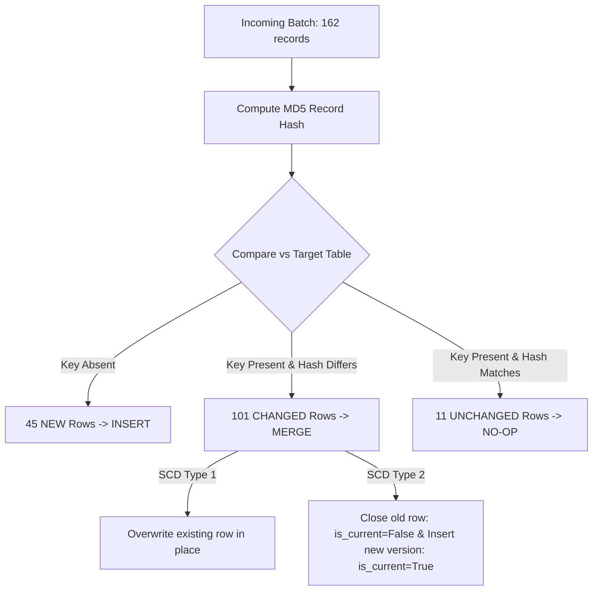
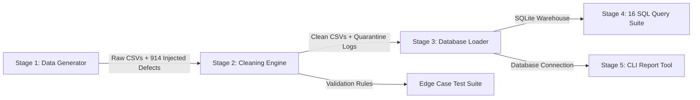

# Celebal Technologies — Data Engineering & Infrastructure Internship

[](https://www.python.org/)
[](https://www.sqlite.org/)
[](https://spark.apache.org/)
[](https://delta.io/)
[](https://azure.microsoft.com/services/data-factory/)


This repository serves as the master portfolio for the **Celebal Technologies Data Engineering Internship**. The work spans exploratory data analysis, relational schema design, advanced SQL window analytics, distributed computing with PySpark, cloud ETL orchestration with Azure Data Factory, Lakehouse storage with Delta Lake (SCD Type 1 & 2), and a production-grade Capstone E-Commerce Analytics System.

---

## Engineer Profile

**Subhodeep Samanta**  
*Full-Stack Engineer | Infrastructure & AI Systems*  
📍 Dehradun, Uttarakhand · 📞 +91 6291445216 · ✉️ [subhodeepsamanta2005@gmail.com](mailto:subhodeepsamanta2005@gmail.com)  
🌐 [Portfolio](https://subhodeepsamanta.github.io) · 💻 [GitHub](https://github.com/subhodeepsamanta) · 🔗 [LinkedIn](https://linkedin.com/in/subhodeepsamanta) · ⚡ [LeetCode](https://leetcode.com/subhodeepsamanta)

### Professional Summary
Full-stack engineer building AI systems, distributed infrastructure, and edge computing solutions. Experienced in building autonomous agents, custom P2P networking protocols, and production software for enterprise clients — with hands-on expertise spanning ARM migration, database optimization, distributed stream processing, and data pipeline design.

### Technical Competencies Matrix

| Domain | Technologies & Frameworks |
|---|---|
| **Languages & Databases** | Python, C++, Java, JavaScript, TypeScript, SQL, PostgreSQL, MongoDB, MySQL, Redis, SQLite |
| **Data Engineering & Cloud** | Apache Spark (PySpark), Delta Lake (`delta-rs`, `delta-spark`), Azure Data Factory (ADF), Azure Blob Storage |
| **Backend & Web Systems** | Node.js, Express.js, Next.js, React.js, Tailwind CSS, REST APIs, GraphQL, JWT, OAuth |
| **Systems & DevOps** | Microservices, Distributed Systems, Docker, AWS, CI/CD, Git, Linux, Embedded/Edge Computing (NVIDIA Jetson) |
| **CS Fundamentals** | Data Structures & Algorithms, Object-Oriented Programming (OOP), DBMS, Operating Systems, Computer Networks |

---

## Repository Curriculum & Architecture Map

```
CelebalAssignments/
├── assets/         Architecture diagrams & visual documentation assets
├── week1/          Myntra E-Commerce Dataset — EDA & Data Cleaning
├── week2/          Superstore Sales Relational SQL Analysis & Loss Discovery
├── week3/          Advanced SQL Analytics — Window Functions, CTEs & Quartiles
├── week4/          Azure Cloud Ingestion & ADF Data Pipeline Orchestration
├── week5/          PySpark Distributed DataFrames — In-Memory Computations
├── week6/          Spark Architecture, Catalyst Optimizer & Parquet Storage
├── week7/          Delta Lake Lakehouse Architecture — SCD Type 1 & 2 Merges
└── Mini-Project/   Capstone: End-to-End E-Commerce Order Analytics System
```

---

## Global Data Pipeline Architecture



---

## Deep-Dive Technical Modules

---

### Week 1 — Myntra E-Commerce Dataset: EDA & Data Cleaning

[📁 View Week 1 Subdirectory](file:///c:/Users/USER/Desktop/CelebalAssignments/week1/README.md)

#### Business Scope & Dataset
Exploratory Data Analysis (EDA) and data preprocessing on an e-commerce shopping dataset containing **1,000 product records across 96 categories**. The goal was to transform unstructured catalog text into a clean tabular structure suitable for machine learning and pricing optimization.

#### Data Pipeline Flow


#### Key Technical Transformations & Code Mechanics
1. **Price Normalization**: Currency symbols (`₹`), commas, and trailing whitespace were stripped using string regex patterns, converting object dtypes into `float64`.
2. **Feature Engineering**:
   - `price_difference`: $ \text{original\_price} - \text{discounted\_price} $
   - `popularity_metric`: $ \log(1 + \text{rating\_count}) \times \text{rating} $
   - `total_amount`: $ \text{discounted\_price} \times \text{quantity} $
3. **Outlier & Duplicate Filtering**: Identified and filtered unrated items and duplicate product entries.

#### Key Empirical Findings
- **Discount Thresholds**: Products carrying discounts over **40%** exhibited a sharp drop in user ratings, signaling perceived quality risks by consumers.
- **Category Price Concentration**: High-ticket categories (Electronics, Wearables) displayed long-tailed price distributions, whereas Apparel items clustered tightly within lower price brackets.

---

### Week 2 — Superstore Sales: Relational SQL Analysis & Profitability Audit

[📁 View Week 2 Subdirectory](file:///c:/Users/USER/Desktop/CelebalAssignments/week2/README.md)

#### Business Scope & Dataset
Relational database analysis of the Sample Superstore dataset containing **9,994 transactional order line items** spanning four years (January 2014 to December 2017).

#### SQL Queries & Key Results

| SQL Analysis Scope | Query Approach | Primary Empirical Insight |
|---|---|---|
| **Category Distribution** | `GROUP BY Category` | **Technology** led overall revenue ($836K) despite fewer orders, whereas **Office Supplies** led total volume (6,026 orders). |
| **Regional Performance** | `GROUP BY Region, Category` | **East** and **West** regions dominated overall sales. **Central** region was the weakest performer across all product lines. |
| **Sales Seasonality** | `GROUP BY STRFTIME('%Y-%m', Order_Date)` | Heavy year-end seasonality. November 2017 recorded the highest single-month sales ($118K). |
| **Customer Concentration** | `SUM(Sales) ... GROUP BY Customer_ID` | Top 10 customers generated $12K–$25K in lifetime spend, far exceeding account averages. |
| **Margin Loss Audit** | `WHERE Profit < 0` | **1,871 out of 9,994 order lines (18.7%) were loss-making**, heavily concentrated in items discounted over **30%**. |

```sql
-- Uncovering unprofitable sales driven by excessive discounting
SELECT 
    Category,
    Sub_Category,
    COUNT(*) AS total_loss_orders,
    ROUND(SUM(Profit), 2) AS total_loss_amount,
    ROUND(AVG(Discount), 2) AS avg_discount
FROM superstore_raw
WHERE Profit < 0
GROUP BY Category, Sub_Category
HAVING AVG(Discount) > 0.30
ORDER BY total_loss_amount ASC;
```

---

### Week 3 — Advanced SQL Analytics: CTEs, Window Functions & Customer Ranking

[📁 View Week 3 Subdirectory](file:///c:/Users/USER/Desktop/CelebalAssignments/week3/README.md)

#### Business Scope & Analytical Concepts
Implementation of complex SQL analytics utilizing Common Table Expressions (CTEs), Window Functions (`DENSE_RANK()`, `ROW_NUMBER()`, `NTILE()`), and subqueries against SQLite to evaluate customer lifetime value and order frequency distributions.

#### Advanced Window SQL Implementation
```sql
-- Customer Segmentation into Spend Quartiles via NTILE(4)
WITH CustomerSpend AS (
    SELECT 
        c.Customer_ID,
        c.Customer_Name,
        ROUND(SUM(o.Sales), 2) AS Total_Sales,
        COUNT(DISTINCT o.Order_ID) AS Order_Count
    FROM customers c
    JOIN orders o ON c.Customer_ID = o.Customer_ID
    GROUP BY c.Customer_ID, c.Customer_Name
)
SELECT 
    Customer_ID,
    Customer_Name,
    Total_Sales,
    Order_Count,
    NTILE(4) OVER (ORDER BY Total_Sales DESC) AS Spend_Quartile,
    CASE NTILE(4) OVER (ORDER BY Total_Sales DESC)
        WHEN 1 THEN 'Platinum'
        WHEN 2 THEN 'Gold'
        WHEN 3 THEN 'Silver'
        ELSE 'Bronze'
    END AS Customer_Tier
FROM CustomerSpend
ORDER BY Total_Sales DESC;
```

#### Analytical Breakdown
- **Top Spenders**: Sean Miller ($25,043.05), Tamara Chand ($19,052.22), and Raymond Buch ($15,117.34).
- **Single-Order Accounts**: Identified **12 accounts** that placed only one order throughout the four-year history.
- **Above-Average Accounts**: **294 out of 793 customers (37.1%)** exceeded the mean total spend of ~$2,897, illustrating right-skewed revenue distribution.

---

### Week 4 — Azure Cloud Infrastructure & ADF Pipeline Orchestration

[📁 View Week 4 Subdirectory](file:///c:/Users/USER/Desktop/CelebalAssignments/week4/README.md)

#### Cloud Architecture & Ingestion Pipeline
Deploying a cloud data integration pipeline using **Azure Data Factory (ADF)** and **Azure Blob Storage** to automate Superstore dataset ingestion.



#### Infrastructure Specifications & IAM Governance
- **Resource Group**: `rg-superstore-pipeline` (Malaysia West)
- **Storage Account**: `stsuperstoreadf` (Blob Container: `superstore-container`)
- **Linked Service**: `ls_blob_superstore`
- **IAM RBAC Assignments**: `Reader`, `Contributor`, `Storage Blob Data Contributor`

#### Resolved Engineering Challenges
1. **Schema 404 Exception**: Solved destination dataset initialization failures by clearing explicit schema import bindings (`Import schema = None`), allowing dynamic target schema inference during execution.
2. **Column Misalignment**: Fixed `DelimitedTextMoreColumnsThanDefined` exceptions caused by unescaped commas inside text fields by replacing static column index mapping with dynamic runtime column resolution.

---

### Week 5 — PySpark Distributed DataFrames: Transformations & Aggregations

[📁 View Week 5 Subdirectory](file:///c:/Users/USER/Desktop/CelebalAssignments/week5/README.md)

#### MapReduce vs. Apache Spark Compute Paradigm
MapReduce incurs severe disk I/O latency by persisting intermediate map outputs to HDFS before reduce stages. Apache Spark keeps intermediate partitions in RAM using resilient distributed datasets (RDDs) and DataFrame DAG lineage, resulting in **10x–100x speed improvements** for iterative algorithms.

#### PySpark Cleaning & State Revenue Aggregation
```python
from pyspark.sql import SparkSession
from pyspark.sql import functions as F

spark = SparkSession.builder.appName("week5-superstore").master("local[*]").getOrCreate()
spark.sparkContext.setLogLevel("ERROR")

# Read raw CSV with custom escape handler
df = spark.read.csv("data/Sample - Superstore.csv", header=True, inferSchema=True, escape='"')

# Deduplicate on composite business key
deduped = df.dropDuplicates(["Order ID", "Product ID"])

# Impute nulls and standardize timestamps
cleaned = (
    deduped.na.fill({"Sales": 0, "Profit": 0})
    .filter(F.col("Order ID").isNotNull())
    .withColumn("order_ts", F.to_timestamp("Order Date", "M/d/yyyy"))
)

# Wide transformation: Aggregate total revenue by State
state_revenue = (
    cleaned.groupBy("State")
    .agg(F.round(F.sum("Sales"), 2).alias("total_revenue"))
    .orderBy(F.desc("total_revenue"))
)
state_revenue.show(10)
```

#### Execution Output Metrics
- **California** led all states with **$457,687.63**, followed by **New York** ($310,827.15) and **Texas** ($170,188.05).
- **Technology** achieved the highest average sale value in the West region ($420.69).

---

### Week 6 — Spark Core Architecture, Lazy Evaluation & Parquet Optimization

[📁 View Week 6 Subdirectory](file:///c:/Users/USER/Desktop/CelebalAssignments/week6/README.md)


#### Cluster Process Layers
1. **Driver Process**: Executes the `main()` application, initializes `SparkSession`, translates code into logical DAG plans, schedules stages and tasks, and tracks application state.
2. **Cluster Manager**: Provisions physical hardware resources across worker nodes (YARN, Kubernetes, or Standalone).
3. **Executor**: Worker processes executing assigned tasks across distributed partitions, holding cached data in memory.

#### Storage Performance Benchmark: CSV vs. Parquet

| Storage Metric | CSV (Row-Based) | Parquet (Columnar Format) |
|---|---|---|
| **Data Layout** | Row-by-row plain text | Columnar projection with Row Groups (128MB) |
| **Compression** | Poor (text overhead) | Superior (Snappy / RLE compression) |
| **Column Pruning** | Must scan 100% of bytes on every line | Reads only the byte offsets for requested columns |
| **Predicate Pushdown** | Unsupported | Uses footer min/max metadata to skip entire row groups |

#### DAG Lineage Fault Tolerance
Spark DataFrames are immutable. When an executor node crashes and loses an in-memory partition, the Driver consults the **Lineage Graph (DAG)** to recompute *only* the lost partition from the original source file or nearest cached checkpoint, avoiding costly disk replication.

---

### Week 7 — Delta Lake Lakehouse Architecture: Incremental SCD Type 1 & 2

[📁 View Week 7 Subdirectory](file:///c:/Users/USER/Desktop/CelebalAssignments/week7/README.md)

#### Medallion Architecture
- **Bronze Layer**: Raw CSV files ingested verbatim as string columns (`dtype=str`) with ACID transaction logging (`_delta_log/`).
- **Silver Layer**: Data normalized, typed, deduplicated, and enriched with MD5 record hash keys.
- **Gold Layer**: Dimension tables supporting **SCD Type 1** (overwrite) and **SCD Type 2** (historical tracking).

#### Native Engine Execution (`delta-rs`)
Uses the high-performance native Rust implementation (`deltalake`), enabling ACID transactions, time travel, and `MERGE` operations without JVM or Java configuration overhead.

#### Change Classification & Dual SCD MERGE Logic



#### Verification & Assertion Results
- **Assertions**: **31 / 31 assertions pass** across table integrity, null checks, surrogate keys, and non-overlapping date ranges.
- **Time Travel**: Asserted that `versionAsOf 0` reproduces the pre-merge snapshot state exactly.

---

### Week 8 — Capstone: End-to-End E-Commerce Analytics System

[📁 View Mini-Project Subdirectory](file:///c:/Users/USER/Desktop/CelebalAssignments/Mini-Project/README.md)


#### System Overview & 5-Stage Architecture



#### Defect Injection & Quality Audit
The generator (`src/generate_data.py`) injects **914 problem rows across 10 distinct issue categories**. The cleaning engine (`src/clean_data.py`) processes every defect according to explicit business logic:

| Defect Category | Rows Affected | Action Taken | Rationale |
|---|---:|---|---|
| Missing `customer_id` | 237 orders | Kept as SQL `NULL` | Preserves financial revenue totals while isolating unauthenticated guest purchases from customer metrics. |
| Non-ISO dates (`DD-MM-YYYY`) | 190 orders | Parsed & rewritten to ISO | Standardizes time-series indexing. |
| Future order dates | 10 orders | Dropped & quarantined | Prevents corruption of YOY and rolling time metrics. |
| Malformed email addresses | 16 customers | Preserved; IDs logged to JSON | Preserves customer history while surfacing CRM data quality tasks. |
| Discount > 100% | 12 line items | Clamped to 100% | Converts entry error into a $0 promotional item rather than an illegal negative refund. |
| Quantity = 0 | 20 line items | Dropped & quarantined | Zero-quantity line items do not represent transactions. |
| Orphan line items | 15 line items | Dropped & quarantined | Enforces referential integrity before SQLite load. |

#### 16 Analytical SQL Business Queries (`sql/queries/`)

```sql
-- Query 16: Product Affinity Pair Analysis (Frequently Bought Together)
SELECT 
    p1.product_name AS product_a,
    p2.product_name AS product_b,
    COUNT(*) AS times_bought_together,
    DENSE_RANK() OVER (ORDER BY COUNT(*) DESC) AS pair_rank
FROM order_items item1
JOIN order_items item2 
  ON item1.order_id = item2.order_id 
 AND item1.product_id < item2.product_id
JOIN products p1 ON item1.product_id = p1.product_id
JOIN products p2 ON item2.product_id = p2.product_id
GROUP BY p1.product_name, p2.product_name
HAVING COUNT(*) > 10
ORDER BY times_bought_together DESC
LIMIT 50;
```

#### Command-Line Reporting Tool Output (`src/report_tool.py`)
```
MONTHLY REPORT   2026-02-01 to 2026-07-31   (181 days)
==============================================================================
Month       Orders     Revenue     Customers
---------  -------  ------------  ----------
2026-02        254    264,530.63         199
2026-03        361    358,722.11         252
2026-04        355    334,916.07         246
2026-05        419    372,917.39         274
2026-06        390    420,629.70         264
2026-07        386    421,265.94         262

Summary vs previous 181 days (2025-08-04 to 2026-01-31)
------------------------------------------------------------------------------
Metric            This period     Previous     Change
----------------  ------------  ------------  -------
Total orders             2,165         1,182   +83.2%
Revenue           2,172,981.84  1,159,304.60   +87.4%
Unique customers           619           456   +35.7%

Top 3 products by revenue
------------------------------------------------------------------------------
Product                    Units    Revenue  
-------------------------  -----  ---------
Meridian Soundbar Z867       124  99,109.16
Zephyr Workstation S297       44  63,260.97
Vantage Cookware Set Z994     99  61,089.41
```

---

## Getting Started & Execution Guide

### Prerequisites
- Python 3.10 or higher
- SQLite3 (built into Python standard library)
- Java 8/11/17 (required only for PySpark notebooks in Weeks 5 & 6)

### Environment Installation
```bash
# Clone the repository
git clone https://github.com/subhodeepsamanta/CelebalAssignments.git
cd CelebalAssignments

# Set up Python virtual environment
python -m venv .venv

# Activate environment (Windows)
.venv\Scripts\activate
# Activate environment (Linux/macOS)
# source .venv/bin/activate

# Install dependencies for the Mini-Project & Delta Lake
pip install -r Mini-Project/requirements.txt
pip install -r week7/requirements.txt
```

### Running the Capstone Pipeline
```bash
cd Mini-Project
python run_pipeline.py
```

### Running the Edge-Case Test Suite
```bash
python tests/test_edge_cases.py
```

---

## License & Attribution

Developed by **Subhodeep Samanta** as part of the Celebal Technologies Data Engineering Internship program.
